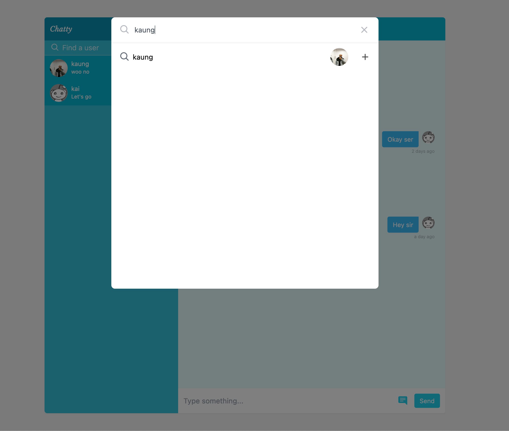
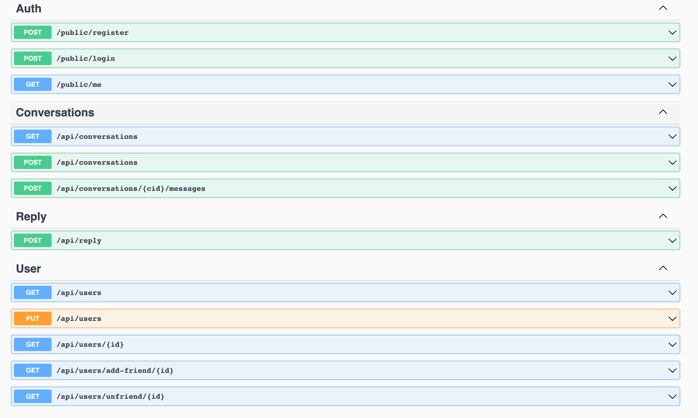

## Chatty

A simple chat app that allows to connect to the people all over the world. Integrated ChatGPT for reply suggestion to make the conversations more enjoyable.

- Tech Stack: React, .Net Core, SignalR, MongoDB, Docker

| Codebase | Description |
| ----------- | ----------- |
| [chatty-app](https://github.com/kkaung/chatty/tree/main/client) | React Application |
| [chatty-api](https://github.com/kkaung/chatty/tree/main/service) | .NET Core Server with SignalR |

Website: https://chatty-pi.vercel.app

## App Previews

- Home Page with Search 
  

- Home Page with Chat 
  

- Api Endpoints
  
